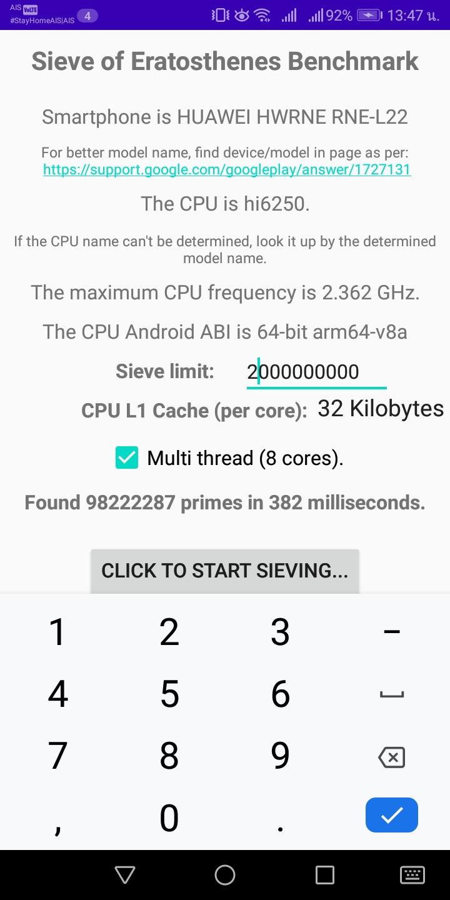

Sieve of Eratosthenes Benchmark
===============================
Sieve of Eratosthenes Benchmark (SoE benchmark) is an Android app that uses JNI to call C code from an Android Kotlin Activity, with the C code generated from the Nim computer language instead of directly from C source files, information is passed back and forth between the native code and Kotlin using function parameters and return values.

This has been adapted from the [sample hello-jnicallback android project](https://github.com/android/ndk-samples/tree/master/hello-jnicallback) as per [the sample adapted to the Nim language](https://github.com/GordonBGood/NimHelloJNICallback).

Comments on the Implementaton
=============================
Although the default Nim Garbage Collector is running in the background to collect strings that may be used on the main thread, the actual sieving threads do manual memory managment since it wasn't that hard to do as there is a distinct point where heap space is required just before the background worker threads are started and another just after the threads in the "thread pool" have been stopped where these allocations can be destroyed.  I could have used the new Nim feature of automatically reference counted memory management (`--gc:arc`) but I don't regard is as stable enough and, as mentioned, it wasn't necessary.  Another alternative would have been to use the new "destructors" feature to destroy them when they go out of scope, but that might have been more complex.  Also, the channels and threadpool libraries haven't been adjusted to be more stable and compatible with this new memory management models.  Due to this, I implemented my own round-robin thread pool(s) with the same number of entries as there are threads available, and work balancing is easy in that each sucessive page segment culling (all of about the same size) is assigned in turn to the thread from which we have just obtained a result.  Each thread is pre-assigned the memory resources it needs by the main thread that creates the thread pool, and (as for the JavaScript code), the necessary base primes are pre-computed.

Why this version of the Sieve of Eratosthenes is so fast
========================================================
The Nim code is generally a translation of [the JavaScript Wheel Factorized Page Segmented SoE in my StackOverflow answer](https://stackoverflow.com/a/57108107/549617) as is well described there, but with added multi-threading which can't easily be done in JavaScript.  It is written in the same imperative style to reflect that code and to make it a little easier for users to understand, although my preferred coding style is to use the functional paradigm.  It is about 25% faster than it would be otherwise through the use of the "unrollloops" extreme loop unrolling macro (you can see what this does by uncommenting the end commands) that can be used if there are enough CPU registers available, which there are for all supported Android targets except x86.  It was particularly easy to implement this extreme unrolling in Nim rather than in C due to being able to use an Abstract Syntax Tree (AST) macro as this is.  In C, one would likely use a code generator for the 32 different loop cases so as to generate the hundreds of lines of similar code instead of this 50 line macro.  Of course, it also gains in speed as compared to the JavaScript version due to compiling to well-optimized native machine code rather than depending on Just In Time (JIT) compilation, no matter how good Chrome/nodejs's V8 Javascript engine is (about two and a half times slower than this same algorithm before the extreme loop unrolling).

If this were done functionally, all of this would be much more elegant in that the base primes would be generated as required by a lazy secondary feed, but this would require reliable closure transfers between threads and I am not yet confident that this can be done reliably using the new memory management system.  For an example of how elegant this could be [see my F# StackOverflow answer](https://stackoverflow.com/a/61057615/549617) which is written mostly functionally.

So how fast is it?
==================
In tests on common platforms where [Kim Waslich's primesieve](https://github.com/kimwalisch/primesieve) runs, for smaller ranges of a few billion, this code is at least as fast if not slightly faster than his code with both run as a console application and timed independently.  For larger ranges of hundreds of billions and above, this still lacks further optimizations to maintain its relative speed, which optimizations I didn't include in this repo because it would add a couple of hundred lines of code and wouldn't aid in the understanding of the algorithm.  The improvement <B>does not require the "bucket sieve"</B> as mentioned in his documentation, which I consider a misapplication of something that was invented for a different purpose:  for sieving small spans (okay) with a huge upper limit bigger than the maximum number expressable in the 64-bit integer range of about 2e19 (which doesn't apply), and when run single threaded (makes it not very suitable for multi-threading); the problem with it is that it eats a lot of memory for the "bucket" storage <B>per thread</B> and is much more complex and consumes much more memory than my solution of just increasing the effective size of the sieve buffers as required to represent a range of the square root of the maximum number being sieved, which technique is at least as fast.  My method means that there are never any missed/wasted calculations of buffer start addresses for base primes that aren't going to "hit" a given sieve buffer (as the buffer size is increase such that they all "hit"), which is exactly the purpose of the "bucket sieve" in storing base prime start addresses that aren't going to "hit" the current buffer in a structure of "buckets" for buffers to be sieved later.

How to Build
============
The build system used here where Nim is used to (`-c`) compile to .c files only and letting the build system turn those files into shared library files seems slightly simpler than using Nim to compile all the way to shared dynamic libraries to be just included by the build system as third party libraries, but this option requires a copy of the `nimbase.h` file be placed in the main/src/cpp directory for use in final copilation of the C source files.  Note that C++ could also be used as the intermediate files just by changing the compilation command from a "c" to a "cpp".

Pre-requisites
--------------
- Android Studio 2.2+ with [NDK](https://developer.android.com/ndk/) bundle.

Getting Started
---------------
1. [Install Nim](https://nim-lang.org/install.html) for your platform (tested with version 1.2.0).
1. [Download Android Studio](https://developer.android.com/sdk/index.html)
1. Install Android Studio as per the instructions.
1. Launch Android Studio.
1. Open *Tools/SDK Manager* and be sure the Android 10.0 (Q) SDK Platform, 29.0.2 SDK Build tools and NDK (Side by side) are installed.
1. Download this repository as a .zip file and extract it to a location of your choice or use git or GitDesktop to clone it.
1. Open the above project location with Android Studio to open the project.
1. From the Android Studio terminal run "buildnim.cmd" (for Windows) or "buildnim.sh" (for Linux/OSX) to compile the Nim files to .c (or .cpp) files.  Note that this must be done each time before building the app if any changes are made to the .nim files!
1. Click *Tools/Android/Sync Project with Gradle Files*.
1. Click *Run/Run 'app'*.
1. Alternatively, you can use "Build/Generate Signed Bundle/APK..." to generate an APK file that can be transfered to an Android phone and "side-loaded".
1. The above involves generating a signing store and key (one time), which can be done almost automatically with Android Studio.
1. You could store the signing store key file in the root directory of this project.

There is a zipped prebuilt signed (with a generated signing key not provided) APK installation file available in [the `app/release` directory](https://github.com/GordonBGood/SieveofEratosthenesBenchmark/blob/master/app/release/SoEBenchmarkAndroid.zip) that can be installed (side-loaded) on Android smartphones after unzipping if one trusts that it's contents reflect the source provided here; if one doesn't trust it, generate a new one as per the alternate process described above.

Screenshot
----------

The above screenshot is from a Huawei Nova 2i with a HiSilicon Kirin 659 CPU; this CPU has 4/4 bit/little ARM Cortex A53 cores (total eight cores), and as shown a maximum core frequence of 2.36 GHz (for the fastest four cores).  By scaling this to the slowest commonly available smartphone with just four Cortex A53 cores (no "big/little"), which lack of the extra "big" cores menas about 25% in performance for this algorithm, we can reliably estimate that such smartphones will be able to perform this sieving for a two billion range in about 800 milliseconds.

The lowest smartphone currently available is probably the Wiko Sunny 4 (and Plus), which has a quad-core 32-bit ARM Cortex A7 CPU (rather than the 64-bit ARM Cortex A53) running at the same 1.3 GHz.  From benchmarks I've seen, the Cortex A7 seems to be about 20% slower than the Cortex A53 at a given CPU clock speed, so even this lowest available smartphone should be able to perform this task of sieving to two billion in under a second (or at least not much more).  I don't know anyone with this low a smartphone, so haven't been able to confirm this as yet.

Smartphones take time that is a significant fraction of these times to run up to maximum speed from standby, so in order to avoid going into standby, these tests should be run with the smartphone to be tested plugged into a computer and file transfer turned on.  That is also the way that the .APK file can be transferred, then the file name tapped in the smartphone file browser to "side load" install, subsequently giving permission to install, then optionally opening the app when installation is complete.

License
-------
Copyright (C) 2020 W. Gordon Goodsman (GordonBGood). All rights reserved.

Permission is hereby granted, free of charge, to any person obtaining a copy
of this software and associated documentation files (the "Software"), to deal
in the Software without restriction, including without limitation the rights
to use, copy, modify, merge, publish, distribute, sublicense, and/or sell
copies of the Software, and to permit persons to whom the Software is
furnished to do so, subject to the following conditions:

The above copyright notice and this permission notice shall be included in
all copies or substantial portions of the Software.

THE SOFTWARE IS PROVIDED "AS IS", WITHOUT WARRANTY OF ANY KIND, EXPRESS OR
IMPLIED, INCLUDING BUT NOT LIMITED TO THE WARRANTIES OF MERCHANTABILITY,
FITNESS FOR A PARTICULAR PURPOSE AND NONINFRINGEMENT. IN NO EVENT SHALL THE
AUTHORS OR COPYRIGHT HOLDERS BE LIABLE FOR ANY CLAIM, DAMAGES OR OTHER
LIABILITY, WHETHER IN AN ACTION OF CONTRACT, TORT OR OTHERWISE, ARISING FROM,
OUT OF OR IN CONNECTION WITH THE SOFTWARE OR THE USE OR OTHER DEALINGS IN
THE SOFTWARE.

[ MIT license: http://www.opensource.org/licenses/mit-license.php ]
